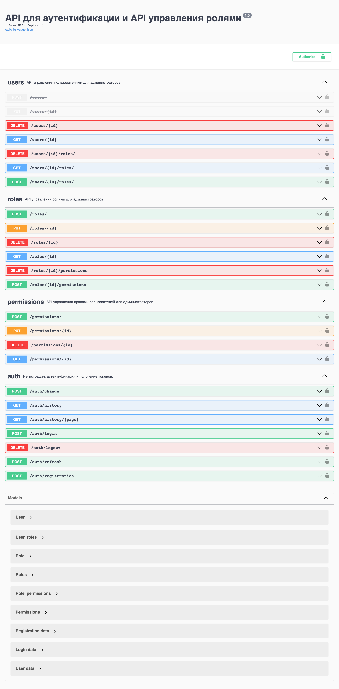

# Сервис авторизации с системой ролей

## API для сайта и личного кабинета

- регистрация пользователя;
- вход пользователя в аккаунт (обмен логина и пароля на пару токенов: JWT-access токен и refresh токен); 
- обновление access-токена и refresh-токена;
- выход пользователя из аккаунта (добаление токенов в blacklisk в redis);
- изменение данных пользователя, включая логин или пароль;
- получение пользователем своей истории входов в аккаунт (с пагинацией).

Каждому пользователю при создании нащначается роль - User.

Создание суперпользователя производится через cli:
```
flask users superuser [OPTIONS] FIRSTNAME LASTNAME EMAIL PASSWORD
```
Суперпользователь обладает неограниченными правами, в том числе давать пользователям другие права и назначать роли.

## API для управления доступами

- CRUD для управления ролями;
- CRUD для управления правами;
- назначить пользователю роль;
- отобрать у пользователя роль;
- добавить права в роль;
- изменить права в роли.

Проверка прав для управления ролями и правами (разрешениями) усуществляется декоратором `@user_has(permissions=...)`

## Документация
Документация API выполнено в Swagger



## Запуск

Файл [docker-compose.yml](docker-compose.yml) обеспечивает сборку окружения для работы сервиса авторизации

```yaml
version: "3.9"
services:
  redis:
    env_file:
      - .env.docker
    container_name: redis
    image: redis:6.2.6
    ports:
      - 6379:6379
    healthcheck:
      test: [ "CMD", "redis-cli", "--raw", "incr", "ping" ]
  postgres:
    image: postgres:14.2
    env_file:
      - .env.docker
    ports:
      - 5432:5432
  auth:
    build:
      context: .
    env_file:
      - .env.docker
    container_name: api
    ports:
      - 5000:5000
    depends_on:
      - postgres
      - redis
    entrypoint: /code/entrypoint.sh
  nginx:
    container_name: nginx
    image: nginx:1.21.6
    volumes:
      - ./nginx/nginx.conf:/etc/nginx/nginx.conf:ro
      - ./nginx/conf.d:/etc/nginx/conf.d:ro
    ports:
      - 80:80
    depends_on:
      - auth
```
## Подключение к Jaeger
- Запустить Jaeger
```
docker run -d -p6831:6831/udp -p16686:16686 jaegertracing/all-in-one:latest
```
* В файле .env.docker указазать следующие переменные окружения:
```
OTEL_RESOURCE_ATTRIBUTES="service.name=auth"
OTEL_PYTHON_FLASK_EXCLUDED_URLS="swagger"
JAEGER_PORT=6831
JAEGER_HOST=localhost
```
- Для отключения сбора телементрии в переменной OTEL_PYTHON_FLASK_EXCLUDED_URLS указать значние ".+"

## Партицирование
Добавлено партицирование таблицы истории входов пользователей по дате входа

## Вход через социальные сервисы
Добавлена регистрация и аутентификация пользователей в Auth-сервисе, через социальные сервисы vkontakte и yandex

В файле .env.docker указазать следующие переменные окружения:
```
VK_APP_ID=vk_app_id
VK_APP_SECRET=vk_app_secret

YANDEX_APP_ID=yandex_app_id
YANDEX_APP_SECRET=yandex_app_secret
```

Для получения данных требуется:
- [Зарегистрировать](https://yandex.ru/dev/id/doc/dg/oauth/tasks/register-client.html) приложение на Яндекс.OAuth.
- Зарегистрировать приложение на vk.com - [инструкция](https://vk.com/dev/first_guide?f=2.%20Регистрация%20приложения)